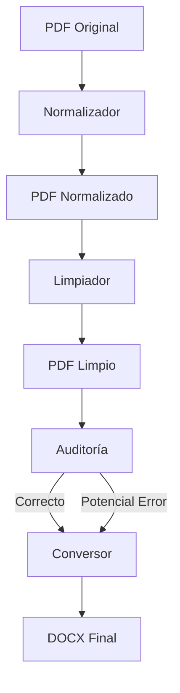

# 🚀 Conversor PDF → Word con Limpieza y Auditoría Automática

Pipeline automatizado en **tres etapas** con interfaz gráfica, diseñado para la conversión masiva de documentos PDF judiciales a Word, garantizando limpieza estructural, control de calidad y auditoría automática.

Está orientado a procesamiento **batch**, asegurando eliminación de encabezados, pies de página, numeración residual y márgenes laterales antes de la conversión final a DOCX.

---

## 📘 Tabla de Contenidos
- [Descripción](#descripción)
- [Características](#características)
- [Arquitectura](#arquitectura)
- [Tecnologías Usadas](#tecnologías-usadas)
- [Instalación](#instalación)
- [Uso](#uso)
- [Estructura del Proyecto](#estructura-del-proyecto)
- [API (si aplica)](#api-si-aplica)
- [Pruebas](#pruebas)
- [Roadmap](#roadmap)
- [Contribuciones](#contribuciones)
- [Licencia](#licencia)
- [Contacto](#contacto)

---

## 📖 Descripción

Este proyecto resuelve un problema frecuente en entornos jurídicos y administrativos:

> La conversión directa de PDF a Word suele arrastrar encabezados, pies de página, numeración y artefactos estructurales que afectan la calidad del documento final.

El sistema implementa una **pipeline en tres etapas**:

1. **NORMALIZADOR** → rompe dependencias entre páginas.  
2. **LIMPIADOR** → elimina encabezados, pies y márgenes.  
3. **AUDITORÍA** → detecta posibles errores residuales.  
4. **CONVERSOR** → genera DOCX de alta fidelidad.  

El resultado es un Word limpio, auditado y con control real de número de páginas.

---

## ✨ Características

- Procesamiento batch de múltiples PDFs.
- Normalización estructural previa.
- Eliminación automática de:
  - Encabezados
  - Pies de página
  - Numeración
  - Márgenes laterales
- Auditoría automática post-limpieza.
- Clasificación automática:
  - `CORRECTOS`
  - `POTENCIALES_INCORRECTOS`
- Conversión híbrida para máxima fidelidad:
  - Primera página con **Spire.PDF**
  - Resto con **pdf2docx**
- Conteo real de páginas usando Microsoft Word (COM).
- Registro automático de errores y correlativos.
- Interfaz gráfica (modo claro/oscuro).

---

## 🧩 Arquitectura



### Flujo Interno

- **Normalización** → Clonación página a página con `insert_pdf`.
- **Limpieza** → Redactions reales con PyMuPDF.
- **Auditoría** → Detección de footers residuales.
- **Conversión** → Spire.PDF + pdf2docx + python-docx.
- **Orquestación** → Control de procesos mediante correlativos `CNN`.

---

## 🛠 Tecnologías Usadas

- **Lenguaje**: Python 3.10+ (recomendado 3.12)
- **Procesamiento Numérico**: numpy~=2.1
- **Manipulación PDF**: PyMuPDF==1.24.10
- **Conversión PDF → DOCX**: pdf2docx==0.5.8
- **Conversión Primera Página**: Spire.PDF
- **Edición DOCX**: python-docx==1.1.2, lxml==5.3.0
- **Separación PDF**: PyPDF2
- **Conteo páginas Word (Windows)**: pywin32==306
- **Sistema requerido**: Windows 10/11 + Microsoft Word instalado

---

## 🔧 Instalación

### Requisitos Previos

- Windows 10 u 11  
- Python 3.10+ (preferible 3.12)  
- Microsoft Word instalado  
- pip actualizado  

Actualizar pip:

```bash
python -m pip install --upgrade pip
```

Instalar dependencias:

```bash
pip install -r requirements.txt
```

---

## ▶ Uso

1. Colocar los PDFs en una carpeta (ej. L01, L02...).
2. Abrir Git Bash o CMD en la carpeta del proyecto.
3. Ejecutar:

```bash
python -m ui.app_tk
```

4. En la interfaz:
   - Seleccionar carpeta origen (PDFs).
   - Seleccionar carpeta destino (DOCX).
   - Ajustar parámetros de detección de footer si es necesario.
   - Pulsar **Convertir**.

El sistema mostrará el progreso por etapas:
- Normalización
- Limpieza
- Auditoría
- Conversión

---

## 📂 Estructura del Proyecto

```
normalizador/
limpiador/
conversor/
ui/
main.py
correlativos.txt
requirements.txt
```

### Archivos Generados

- `_pdfs_normalizados/`
- `_pdfs_limpios/`
- `CORRECTOS/`
- `POTENCIALES_INCORRECTOS/`
- `procesados-LNN-YYY.txt`
- `errores-CNN-carpeta.txt`
- `CORRECTOS-LNN-BBB.txt`
- `POTENCIALES INCORRECTOS-LNN-AAA.txt`
- `NORMALIZADOS_RAROS-LNN-CCC.txt`

---

## 📡 API (si aplica)

No aplica.  
El sistema funciona como aplicación de escritorio con interfaz gráfica.

---

## 🧪 Pruebas

El sistema realiza validaciones automáticas mediante:

- Auditoría post-limpieza.
- Conteo real de páginas PDF vs DOCX usando Word (COM).
- Registro automático de errores por etapa.

---

## 🛣 Roadmap

- [ ] Optimización de detección automática de footer.
- [ ] Implementación multiplataforma (sin dependencia de Word).
- [ ] Generación de reporte PDF consolidado.
- [ ] Empaquetado como ejecutable (.exe).
- [ ] Integración con base de datos para trazabilidad histórica.

---

## 🤝 Contribuciones

Las contribuciones son bienvenidas.

1. Crear una rama (`feature/nueva-funcionalidad`).
2. Documentar claramente los cambios.
3. Realizar pruebas antes del pull request.

---

## 📝 Licencia

Definir licencia (MIT recomendada si se desea uso abierto).

---

## 📬 Contacto

**Autor:** Taipe Sicha Ronny Andy  
**Correo:** ronny.taipe.s@uni.pe  
**Código UNI:** 20211404I  
